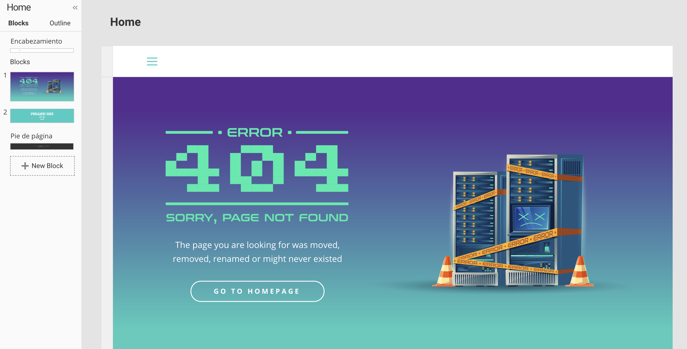

# Simple Web Site

Simple website for testing :four: :zero: :four:

Do it with [https://nicepage.com/](https://nicepage.com/)

## License

MIT License

See [LICENSE](https://github.com/aramirol/simple-website/blob/main/LICENSE) to see the full text.
